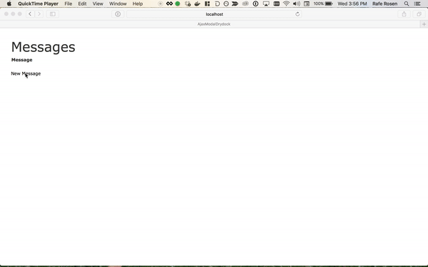

# AjaxModalRails
[](https://travis-ci.org/existentialmutt/ajax_modal_rails)
This plugin provides a simple way to do common modal interactions in a rails app.  Keep your nice thin scaffolded controller, and just include a single mixin.  Then add data attribute to links and forms to load pages via ajax in a modal.



## Installation
Add this line to your application's Gemfile:

```ruby
gem 'ajax_modal_rails', '~> 1.0'
```

And then execute:
```bash
$ bundle
```

### Setup Layout and Javascript
Run `rails generate ajax_modal_rails:install` to require the necessary javascript in `application.js` and add a partial render to the bottom of the body in `layouts/application.html.erb|haml`

#### Manual Installation

Add `//= require ajax_modal_rails` to `app/assets/application.js`

A page that opens a modal should call `render 'ajax_modal_rails/frame'` somewhere on the page.  We recommend you do this in your layout so the modal frame is available for all pages.

## Usage

Once everything is set up, loading to modals is pretty simple

### Views

Add the attribute `data-loads-in-ajax-modal` to a link and it's request will load in a modal over the current page.

Add the attribute `data-submits-to-ajax-modal` to a form and the response from the form's submit will load in the modal frame.

### Controller

A controller that is processing actions to be loaded in a modal should `include AjaxModalRails::Controller`

The mixin sets the appropriate layout for modal requests and adds behavior that allows a modal request that results in a redirect to redirect the whole page.

## Example

These snippets are taken from the included [example application](spec/dummy)

*app/controllers/messages_controller.rb*
```ruby
class MessagesController < ApplicationController
  before_action :set_message, only: [:edit, :update, :destroy]

  include AjaxModalRails::Controller
  ...
```

*app/views/messages/index.html.erb*
```erb
<%= link_to 'New Message', new_message_path, data: {loads_in_ajax_modal: true} %>
```

*app/views/messages/\_form.html.erb*
```erb
<%= form_with(model: message, data: {submits_to_ajax_modal: true}) do |form| %>
```

## Customization

If you want to customize the behavior of this gem, run `rails generate ajax_modal_rails:customize`.  It will copy the views, javascript, and controller mixin into your application.

## Requirements

The provided modal views and javascript require [Twitter Bootstrap 4.0](https://getbootstrap.com/docs/4.0/getting-started/introduction/).  You can do some customization if your app is using something else (see above).

## License
The gem is available as open source under the terms of the [MIT License](http://opensource.org/licenses/MIT).

## Gratitude
This gem was made possible by a Professional Development benefit from my employer, [Green River](http://www.greenriver.com)